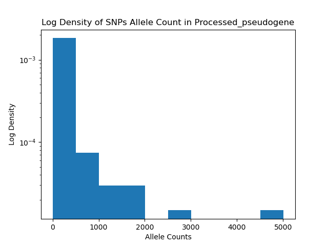

E1.  
After running this script, you can get 'How many bps each feature covers':  
```
--- Subsetting exons.chr21.bed.vcf
    + Covering 1107407 bp
--- Subsetting processed_pseudogene.chr21.bed.vcf
    + Covering 956640 bp
--- Subsetting protein_coding.chr21.bed.vcf
    + Covering 13780687 bp
```
  
To compare two images, ImageMagick is a competent tool. After installed ImageMagick, we can use fuction `convert`:  
`$ convert a.png a.rgba`  
`$ convert b.png b.rgba`  
Then use `$ cmp {a,b}.rgba`, if there is any difference, it will be displayed as:  
`a.rgba b.rgba differ: byte n, line n`
  
For gene type:  
1) Transcribed Unprocessed pseudogene: Unprocessed pseudogenes are duplicates of DNA with premature stop codon or frameshift. As a pseudogene, the tolerance of mutations is high. And compared with processed pseudogenes, unprocessed pseudogenes can also carry mutations in introns of the orginal gene.  
2) miRNA: miRNA mainly participate in regulation of translation. Though they play important role in protein translation, I guess their tolerance of mutations could not be to low. Because, instead of directly deciding protein synthesis, miRNA inhibit exprssion by base-pairing, which can still work with the existence of certain amount of mutations. It can be intersting to see if my assumption is correct.  
3) lncRNA: lncRNAs are transcripts more than 200 nucleotides that are not translated into proteins. They play important roles in epigenetic regulation. I guess their tolerance to mutations can be similar to miRNA.  
  
  
E2.  
Trends: The overall trend of SNP counts is that most SNPs have low allele counts. And there are less and less SNPs as allele counts go up.  
Just a bold guess of how this trend is formed.   
For why many SNPs are carried by a small group of people, there canbe two opposite ways to explain it.   
First is that these regions are not so important, so the selection pressure of the mutations in these regions is low. These regions can be pseudogenes, introns, and even the third positions of some codons.  
Thus, the mutations can randomly spread in these regions. And the allele counts only means that this SNP happens to appear in several non-related groups, as coincidences, rather than the result of any selection.  
I believe most of the SNPs carried by small group of people are of this situation.  
And this can be used to explain why less important genes like pseudogenes and regulative RNAs have many SNPs with low allele counts.
An opposite way to cause the same phenomenon can be that these regions are highly important. So mutations in these regions are facing strong negative selection.  
So it can only be observed in certain pedigrees of small groups or in specific local environments where this SNP can bring some benefits to neutralize the negative selection pressure.  
In this way, it is also reasonable to see these SNPs only carried by small group of people.
And this can be used to explain why important regions like exons and protein_coding genes have many SNPs with low allele counts.  
   
For SNPs carried by large populations. There can be only one explanation, which is that this SNP bring quite big benefits to the carriers, so that it can be spead in a certain group of people.  
And this can be used to explain why protein coding genes have relatively more SNPs with high allele counts.  
This can happens in protein coding genes more frequently because the possibility of a mutation leading to selection advantage is higher in coding regions than in regulative regions.  
  
  
E3.  
SYNOPSIS  
     bxlab/cmdb-plot-vcfs/{do_all.sh subset_regions.sh plot_vcf_ac.py}  
	 Parse .gtf file storing genes and .vcf file storing SNPs. Annote gene type to SNPs. And plot density of SNP allele counts in different gene types.  
  
USAGE  
     bash do_all.sh <.vcf file for snippets> <.gtf file for genes>  
  
Dependencies  
     Bash, Python3, bedtools in Bash, matplotlib.pyplot in Python  
  
DESCRIPTION  
     1. Create .bed files for features of interest  
         - Run subset_regions.sh Bash script  
         - Use grep to extract all chr-n (Here n is 21) infomations and write that into 'chrn.gtf'   
		 - Go through every gene types that we are intereted in   
		 - Use grep to extract all the information of a certain type of gene, and write that into 'genetype.chrn.bed'  
     2. Create .vcf files storing SNPs of each gene type  
	     - Go back to do_all.sh Bash script  
		 - Use bedtools sort to sort the genes in the .bed files generated above. Then use bedtools merge to exclude overlap segments.  
		 - Calculate the total length of each gene type and print as '+ Covering n bp'  
		 - Use bedtools intersect to extract all the SNPs in each genetype and write into file 'genetype.chrn.bed.vcf'  
	 3. Plot the density of AC for SNPs of each genetype  
	     - Run plot_vcf_ac.py Python script  
		 - Use the 'genetype.chrn.bed.vcf' file generated above as input  
		 - Use a for loop to go through each line, extractint the AC number, converting them into integer and writing them into a list 'ac'  
		 - Use matplotlib.pyplot to draw histograms for each genetype, preview them and save them as 'genetype.chrn.bed.vcf.png'  
  
Output  
     Preview of each histograms and the .png files will be saved to the current directory.  
	   
	 Example figure