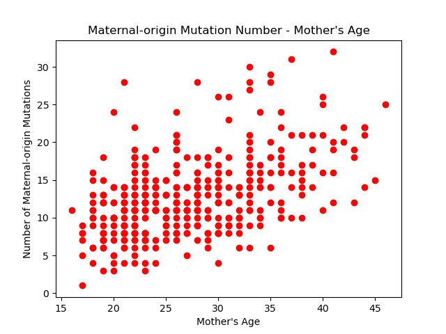
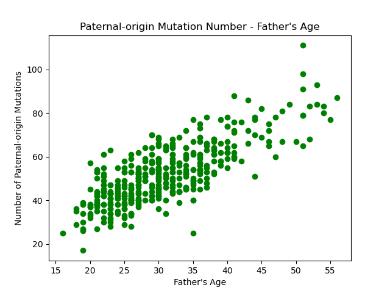
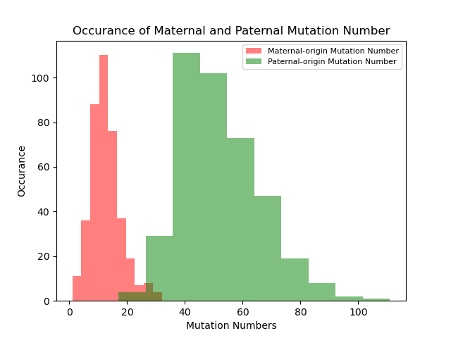

E1.  
Bash code:  
`tail -n+2 aau1043_dnm.csv | sort -k 6 -t , | grep 'father' | cut -f 5 -d , | sort -k 1 |  uniq -c | sort -k 2 > proband_fthr_number.txt`  
`tail -n+2 aau1043_dnm.csv | sort -k 6 -t , | grep 'mother' | cut -f 5 -d , | sort -k 1 |  uniq -c | sort -k 2 > proband_mthr_number.txt`  
`join -1 2 -2 2 -e '0' proband_fthr_number.txt proband_mthr_number.txt > proband_fthr_mthr.txt`  
`tail -n+2 aau1043_parental_age.csv| sort -k 1 -t , | tr , '\t' > age_sorted.txt`   
`join -1 1 -2 1 proband_fthr_mthr.txt age_sorted.txt > proband_fthr_mthr_age.txt`
  
   
   
E2.  
ex2_a.png  
  
  
ex2_b.png  
  
  
3.  
The relationship is significant. The size is 0.3776.  
  
4.  
The relationship is significant. The size is 1.3538.  
  
5.  
ex2_c.png  
  
  
6.  
It is significant.  
  
7.  
78.018535 de novo mutations.