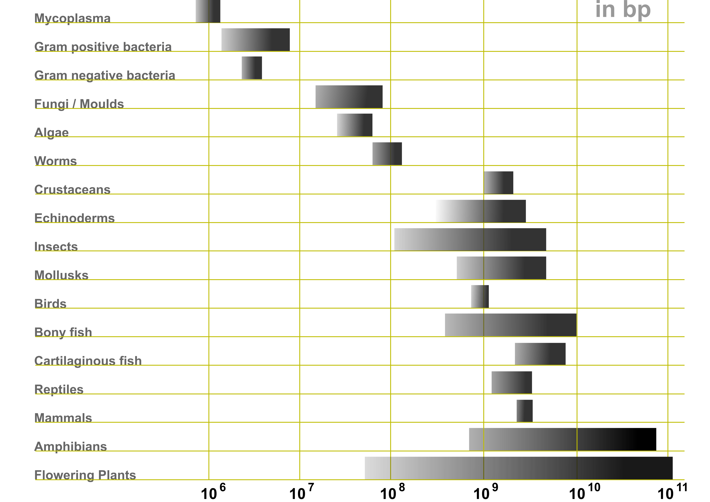
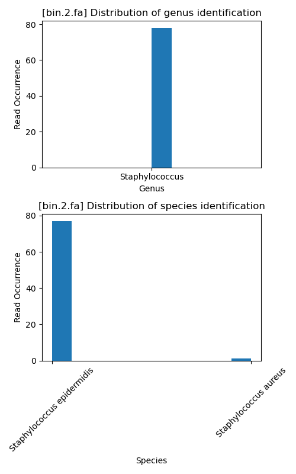
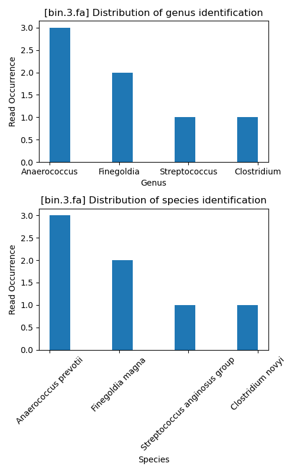
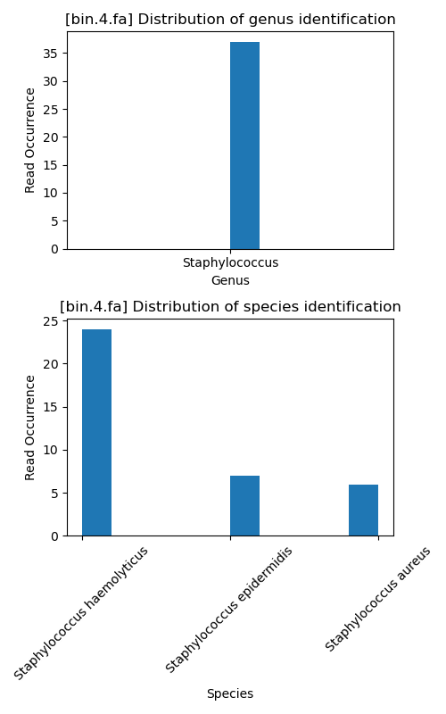
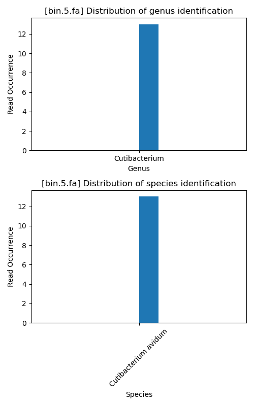

# Pre-step:  
`curl -OL https://github.com/bxlab/cmdb-quantbio/raw/main/assignments/lab/metagenomics/extra_data/metagenomics_data.tgz`  
`tar -xzvf metagenomics_data.tgz`  
  
# Step 1: (in dir "week14-homework")  
`bash step1b.sh`  
`bash step1c.sh`  
Answer to question 1:  
According to the taxonomies, _Enterococcus_ genus takes the dominant position in the whole week, with _Enterococcus faecalis_ strains D32, OG1RF, V583 and Symbioflor_1 keeping occupying several percentages at a certain stasis.  
_Staphylococcus_ genus starts to colonize at the begining and gradually thrives afterwards, with _Staphylococcus epidermidis_ being the most abundant species in this genus.  
Actinobacteria starts to colonize on DAY 4 and gradually thrives afterwards, with _Cutibacterium avidum_ being the most aundant species in the genus. There is a shrap drop of the percentage of this genus on the last day, which possibly is the result of the rapid increase of _Staphylococcus_ genus.  
  
# Step 2:  
Answer to question 2:  
The basic idea of contig grouping (or assembly) is string matching. By align the overlapping region of different contigs, they can be assembled into longer contigs or the whole genome.  
However, there can be challenges like errors in sequencing, individual variations, repeats and conserved sequences.  
To deal with the potential sequencing errors or indivadual variations, we can use similarity of overlapping part as an additional parameter.  
To deal with the repeats and conserved sequences, it is a good idea to increase the coverage so that there are higher possibility to locate repetitve sequences by flanking regions.  
`bwa index metagenomics_data/step0_givendata/assembly.fasta`  
`bash step2b.sh`  
`cp ~/miniconda3/envs/metabat2/lib/libdeflate.so ~/miniconda3/envs/metabat2/lib/libdeflate.0.dylib`  
`conda activate metabat2`  
`jgi_summarize_bam_contig_depths --outputDepth depth.txt *.bam`  
`metabat2 -i ./metagenomics_data/step0_givendata/assembly.fasta -a depth.txt -o bins_dir/bin`  
  
Answer to question 3A:  
__6 bins (13187322 bases in total) formed.__  
  
Answer to question 3B:  
`python question3bc.py`  
__The represented percentage in bin_5 is: 6.52%.__  
__The represented percentage in bin_1 is: 7.11%.__  
__The represented percentage in bin_4 is: 3.23%.__  
__The represented percentage in bin_3 is: 4.35%.__  
__The represented percentage in bin_6 is: 7.52%.__  
__The represented percentage in bin_2 is: 5.91%.__  
__The percentage of reads represented by all bins is: 34.64%.__  
Only a small part of the reads in assembly reference genome can be represented in bins. This means that there are a lot of fragments can not be assigned to any specific genomes. These remaining fragments do not have critical sequences for species identification, like 16S rDNA and the pattern of the series of pyhlogenically shared characters; or not have overlaps or indirect connections with these identification sequences. This can be caused by some species whose abundances are so low that there genome information can be lost in sequencing. This can be improved by increasing the coverage so that hiden sequences of microbes with low abundance can be detected.   
  
Answer to question 3C:  
`python question3bc.py`  
__The assembled size in bin_5 is: 2483660.__  
__The assembled size in bin_1 is: 2705023.__  
__The assembled size in bin_4 is: 1227903.__  
__The assembled size in bin_3 is: 1656034.__  
__The assembled size in bin_6 is: 2862852.__  
__The assembled size in bin_2 is: 2251850.__  
According to this figure, the prokaryotic genome size is normally be in the range between 10^6 and 10^7.  
  
In our assembly, the genome sizes are all around several Mbps, which fits in the empirical range very well.  
  
Answer to question 3D:  
For completeness, we can assess it by checking the presence or absence of highly conserved genes in a phylogenetic lineage. If some conserved genes are missing or the abundances of them is too low, the completeness of this assembly can be low.  
For contamination, we can assess the presence of known unique genes or variations. If there are sequences that are not contained by sibling species and have quite large genetic distances from the variations of sibling species, it may suggest that there are contaminated fragments being assembled to the genome.  
  
# Step 3:  
Answer to question 4A:  
`python step3.py`  
Bin 1: _Staphylococcus aureus_  
  
Bin 2: _Staphylococcus epidermidis_ Though there are a small number of reads were assigned to _S. aureus_, the significance between two species is large enough for concluding the prediction.  
  
Bin 3: Failed to give prediction. The reads were almost equally assigned to four different genus and four different species. To be noticed, there was also a node with phylogenetic info missing species, as the warning info is showing below:  
`Warning: Found one node with missing phylogenetic info when processing file:`  
`[bin.3.fa]`  
`Node ID: NODE_90_length_68573_cov_147.031802.`  
`Node Info: root;cellular organisms;Bacteria;Terrabacteria group;Firmicutes;Clostridia;Clostridiales;Clostridiaceae;Clostridium`  
  
Bin 4: _Staphylococcus haemolyticus_ This bin has high possibility to be _S. haemolyticus_. According to the histogram at genus level, we can conclude that this bin is of _Staphylococcus_ genus. However, with relatively high occurrence in other two species within _Staphylococcus_ genus, it is hard to fully exclude the possibility of this bin being other species in _Staphylococcus_.  
  
Bin 5: _Cutibacterium avidum_  
  
  
Answer to question 4B:  
Do BLAST to every read in each bin. For each read, record the BLAST scores of hits with top 10 similarity. Then put all the recorded hits together to draw a phylogenetic tree. The weight on each branch can be calculated as the add-up of the similarity scores in all the times when the hit is listed as top 10. Then we pick the branch with the highest weight as the predicted species. Also, as a further quantitative validation adn quality-control, we should see the weight decreases as phylogentic distance increases in the tree, which represents a good assembly and prediction.  
To be noticed, due to the different length of the reads, it is possible that there are less longer reads falling into one species and are more shorter reads falling into another species, which will lead to huge bias in prediction. This is also a problem in the way we did prediction in step 3. To tackle this problem, we can divide each reads into pieces with the same or similar length (for example, all around 200 bp). And do the BLAST and calculating process above for every piece. Only in this way, the occurrences can have phylogenetic meanings to reflect the truth.  
  
Answer to question 5:  
Optional.  