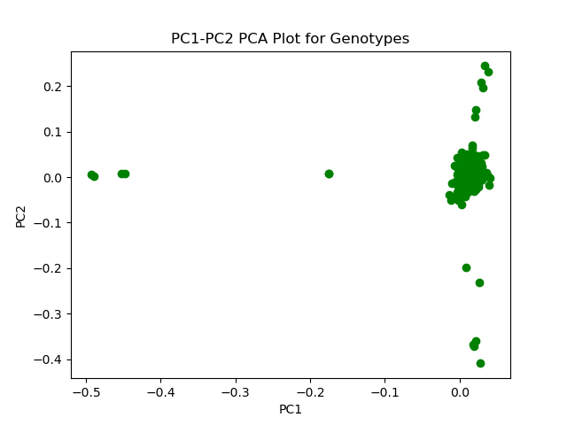
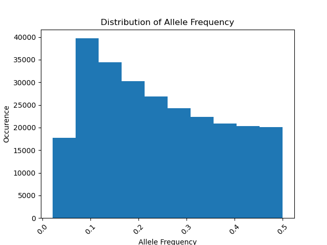
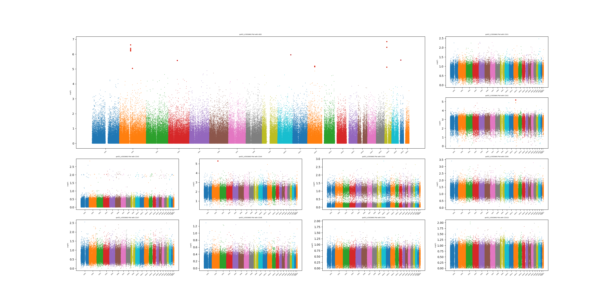
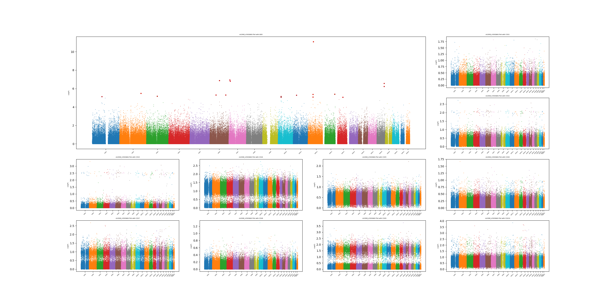
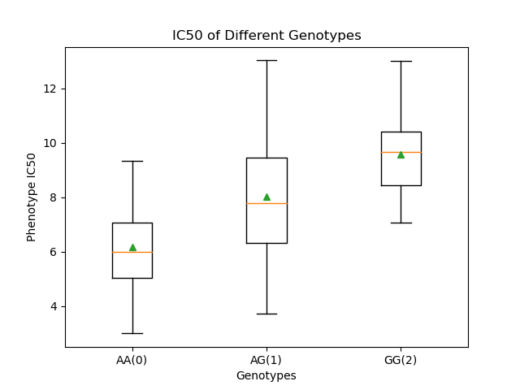

Q1:  
`plink --vcf gwas_data/genotypes.vcf --out plink --const-fid --allow-extra-chr --pca 10`  
  
Q2:  
`python Q2.py plink.eigenvec 10`  
  
Example figure  
  
Q3:  
`plink --vcf gwas_data/genotypes.vcf --freq --out af`  
`python Q3.py af.frq`  
  
Example figure  
  
Q4:  
`awk -F '[_]' '{print $2}' OFS='\t' plink.eigenvec > test.txt`  
`awk -v OFS="\t" '{$1=$1;print}' test.txt > vec_tab.txt`  
`awk '{print $1, $1, $2, $3, $4, $5, $6, $7, $8, $9, $10, $11}' OFS='\t' vec_tab.txt > cov.txt`  
`# to generate tab-separated FID and IID columns in pca results`  

`plink --vcf gwas_data/genotypes.vcf --linear --pheno gwas_data/GS451_IC50.txt --covar cov.txt --allow-no-sex --out gs451_ic50`  
`plink --vcf gwas_data/genotypes.vcf --linear --pheno gwas_data/CB1908_IC50.txt --covar cov.txt --allow-no-sex --out cb1908_ic50`  

Q5.  
`awk -v OFS="\t" '{$1=$1;print}' gs451_ic50.assoc.linear > gs451_ic50.assoc.linear.txt`  
`awk -v OFS="\t" '{$1=$1;print}' cb1908_ic50.assoc.linear > cb1908_ic50.assoc.linear.txt`  
`# to replace all the delimiters with TAB`
  
`python Q5.py gs451_ic50.assoc.linear.txt 22 10`  
OUTPUT: `The top assocaiated SNP is rs7257475 on chromosome 19`  
  
Example figure  
  
`python Q5.py cb1908_ic50.assoc.linear.txt 22 10`
OUTPUT: `The top assocaiated SNP is rs10876043 on chromosome 12`  
  
Example figure  
  
Q6.  
`python Q6.py rs10876043 gwas_data/genotypes.vcf gwas_data/CB1908_IC50.txt`  
  
Example figure  
  
Q7.  
GS451 rs7257475 ZNF826: stated as a pseudogene  
CB1908 rs10876043 DIP2B: Disco Interacting Protein 2 Homolog B. The encoded protein contains a binding site for the transcriptional regulator DNA methyltransferase 1 associated protein 1 as well as AMP-binding sites. The presence of these sites suggests that the encoded protein may participate in DNA methylation. 