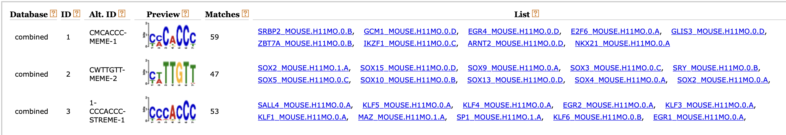

# Q1.  
STEP 1:  
`samtools view -b -q 10 D2_Sox2_R1.bam > D2_Sox2_R1_filtered.bam`  
`samtools view -b -q 10 D2_Sox2_R2.bam > D2_Sox2_R2_filtered.bam`  
`samtools view -b -q 10 D2_Sox2_R2_input.bam > D2_Sox2_R2_input_filtered.bam`  
`samtools view -b -q 10 D2_Sox2_R1_input.bam > D2_Sox2_R1_input_filtered.bam`  
  
STEP 2:
mm10 chr17: 94987271  
`macs2 callpeak -t D2_Sox2_R1_filtered.bam -c D2_Sox2_R1_input_filtered.bam -g 94987271 -B -n SOX2_R1`  
`macs2 callpeak -t D2_Sox2_R2_filtered.bam -c D2_Sox2_R2_input_filtered.bam -g 94987271 -B -n SOX2_R2`  
  
STEP3:  
`bedtools intersect -a SOX2_R1_peaks.narrowPeak -b SOX2_R2_peaks.narrowPeak -wa> intersect`  
  
STEP4:  
`bedtools intersect -a intersect -b D2_Klf4_peaks.bed -wb > S-K-intersect`  
`wc -l S-K-intersect`  
OUTPUT: `41 S-K-intersect`  
`wc -l D2_Klf4_peaks.bed`  
OUTPUT: `60 D2_Klf4_peaks.bed`  
Percentage = 41/60 = 68.33%  
  
STEP5:  
A bash script is wrote to do this step.  
`bash Q1_STEP5.sh`  
`python Q1_STEP5.py _scaled_cropped.bdg`  
  
Example figure  

# Q2.  
`conda activate meme`  
`conda install -c conda-forge openmpi=4.1.4 -y`  
`ln -s /Users/cmdb/data/genomes/mm10.fa ./`  
`sort -k 5 -r -n intersect | head -300 > intersect_sorted_300`  
`awk '{ printf "%s:%i-%i\n", $1, $2, $3 }' intersect_sorted_300 > intersect_sorted_300_formated`  
`samtools faidx mm10.fa -r intersect_sorted_300_formated -o intersect_peak_sequences.fa`  
`meme-chip -maxw 7 intersect_peak_sequences.fa -oc chip_output`  
  
# Q3.  
`tar -xf motif_databases.12.23.tar`  
`tomtom ./chip_output/combined.meme ./motif_databases/MOUSE/HOCOMOCOv11_full_MOUSE_mono_meme_format.meme -oc tomtom_output`  
  
Example figure  
`grep "KLF4_" ./tomtom_output/tomtom.tsv | cat header.txt - > klf4_matches.txt`  
`grep "SOX2_" ./tomtom_output/tomtom.tsv | cat header.txt - > sox2_matches.txt`
