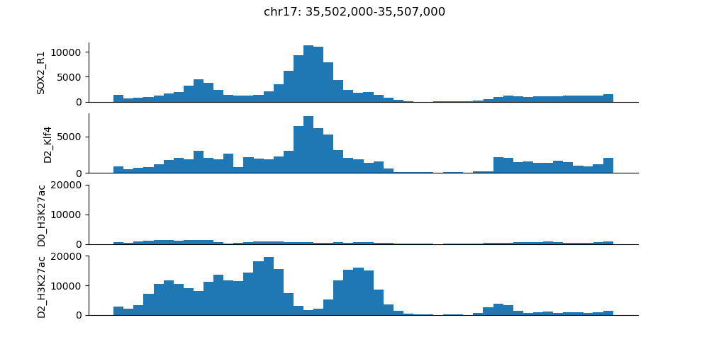

# Q1.  
STEP 1:  
`samtools view -b -q 10 D2_Sox2_R1.bam > D2_Sox2_R1_filtered.bam`  
`samtools view -b -q 10 D2_Sox2_R2.bam > D2_Sox2_R2_filtered.bam`  
`samtools view -b -q 10 D2_Sox2_R2_input.bam > D2_Sox2_R2_input_filtered.bam`  
`samtools view -b -q 10 D2_Sox2_R1_input.bam > D2_Sox2_R1_input_filtered.bam`  
  
STEP 2:
mm10 chr17: 94987271  
`macs2 callpeak -t D2_Sox2_R1_filtered.bam -c D2_Sox2_R1_input_filtered.bam -g 94987271 -B -n SOX2_R1`  
`macs2 callpeak -t D2_Sox2_R2_filtered.bam -c D2_Sox2_R2_input_filtered.bam -g 94987271 -B -n SOX2_R2`  
  
STEP3:  
`bedtools intersect -a SOX2_R1_peaks.narrowPeak -b SOX2_R2_peaks.narrowPeak -wa> intersect`  
  
STEP4:  
`bedtools intersect -a intersect -b D2_Klf4_peaks.bed -wb > S-K-intersect`  
`wc -l S-K-intersect`  
OUTPUT: `41 S-K-intersect`  
`wc -l D2_Klf4_peaks.bed`  
OUTPUT: `60 D2_Klf4_peaks.bed`  
Percentage = 41/60 = 68.33%  
  
STEP5:  
A bash script is wrote to do this step.  
`bash Q1_STEP5.sh`  
  
Example figure  

# Q2.  
