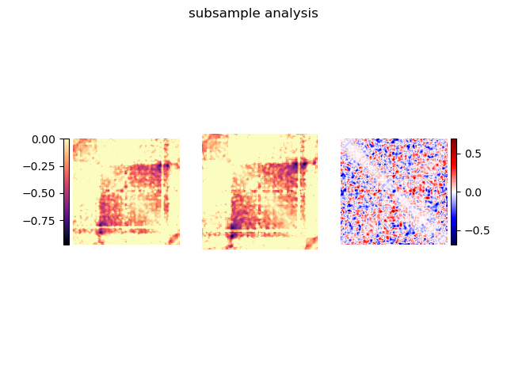
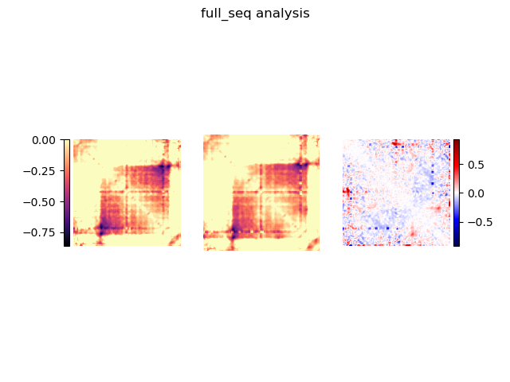
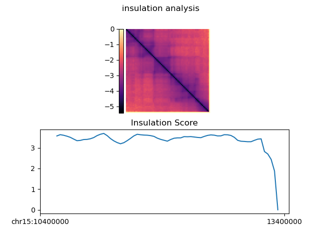

# Part 1:  
1.  
For dCTCF data, there are 92% of reads that are not duplicate. And within these reads, 37.8% of reads are valid interactions.   
For ddCTCF data, there are 88% of reads that are not duplicate. And within these reads, 36.6% of reads are valid interactions.   
These data showed that around 36% ~ 38% reads are ligated correctly in the experiment. Based on reports from other studies using Hi-C, this percentage showed appreciatable ligation quiality.  
  
2.  
According to the fragment quality stack chart, all most all the invalid reads were dangling reads, which means the interaction fragments remained unligated so that from the seqeuncing results, you will will only get one side of the genome interactions from the two crosslinked ones.  
  
# Part 2:  
`python 3dgenome_data/load_data.py analysis/hic_results/matrix/dCTCF/iced/6400/dCTCF_ontarget_6400_iced.matrix analysis/hic_results/matrix/ddCTCF/iced/6400/ddCTCF_ontarget_6400_iced.matrix analysis/hic_results/matrix/dCTCF/raw/6400/dCTCF_ontarget_6400_abs.bed subsample`  
  
Example figure  

`python 3dgenome_data/load_data.py 3dgenome_data/matrix/ddCTCF_full.6400.matrix 3dgenome_data/matrix/dCTCF_full.6400.matrix 3dgenome_data/matrix/6400_bins.bed full_seq`  
  
Example figure  
  
`python insulation.py 3dgenome_data/matrix/dCTCF_full.40000.matrix insulation`  
  
Example figure  
  
1.  
There is a such difference for full-sequence analysis. However, for analyzed subsample, the difference is hard to tell.  
  
2.  
Higher sequencing depth can provide larger potential for better resolution.  
  
3.  
This means dCTCF has more genomic interactions at this position than ddCTCF.