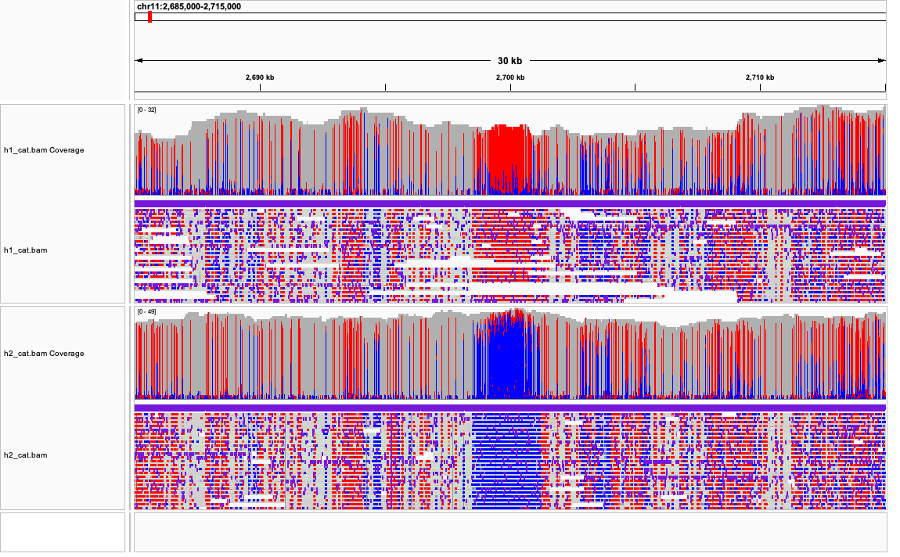
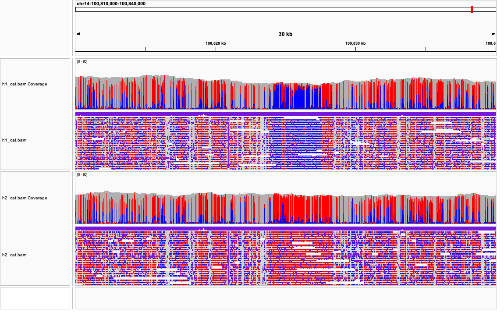
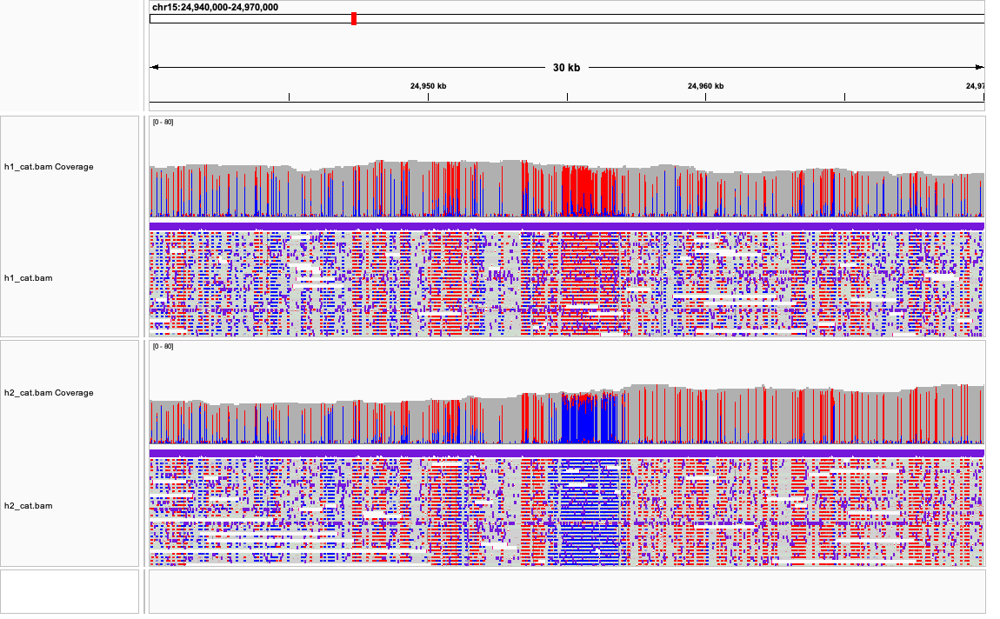
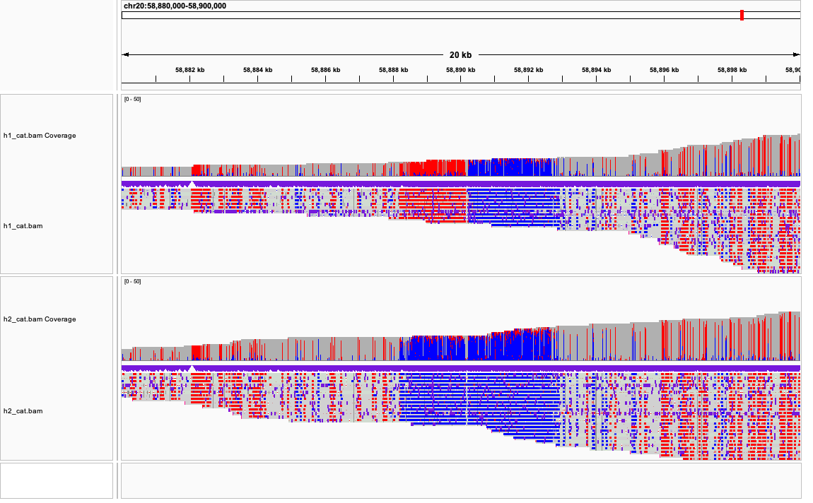

# Part 1:  
`bash part1.sh regions.bed methylation.bam hg38.fa`  
  
# Part 2:  
`bash part2.sh`  
  
# Part 3:  
`bash part3.sh`  
  
# Part 4:  
`conda deactivate`  
`conda create -n igv gradle openjdk=11 -y`  
`conda activate igv`  
`git clone https://github.com/igvteam/igv.git`  
  
`cd igv`  
`./gradlew createDist`  
`cd ../`  
  
`ln -s ${PWD}/igv/build/IGV-dist/igv.sh ./`  
  
# Part 5:  
`samtools index h1_cat.bam`  
`samtools index h2_cat.bam`  
  
# Part 6:  
Chr11: KCNQ1OT1
  
  
Chr14: MEG3  
  
  
Chr15: SNURF  
  
  
Chr20: NESP55  
  
  
Answer to the Q:  
The answer should depends on how well phasing step worked. If the phasing algorithm merely uses overlapping variants to distinguish haplotype, the segments without such variants might be assigned to incorrect haplotype. Similarly, since here is no overlap between different chromosomes, it is possible that chromosomes from different source are assigned to one haplotype.  
Thus, it is highly possible that regions in each H1 and H2 cannot correspond to the same side of parent. To make things better, sequencing information of parents that contains SNPs for comparison can be included in phasing step.